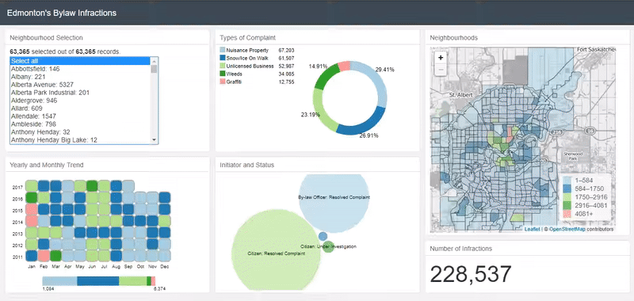

# Bylaw Infractions Dashboard

# Dashboard Summary
Built to analyze bylaw infractions data acquired from [Open Data (City of Edmonton)](https://data.edmonton.ca/Community-Services/Bylaw-Infractions/xgwu-c37w). The data comprises of 63,365 rows. Each row has 13 attributes as shown on the Open Data website. All of the data was used in this example even though 2017 data is incomplete. However, only 9 attributes were used to make the dashboard. Each option has their own instance of pie chart, heatmap, bubble cloud, location on the map, and total number of infractions.The first instance of the dashboard is select all, whereby all of the options are selected and the total number of infractions is shown.

Inspiration for the project: [Interactive Data Visualization of Geospatial Data](http://adilmoujahid.com/posts/2016/08/interactive-data-visualization-geospatial-d3-dc-leaflet-python/) 
Frameworks used include: [crossfilter.js](http://square.github.io/crossfilter/), [dc.js](https://dc-js.github.io/dc.js/), [d3.js](https://d3js.org/), [leaflet.js](http://leafletjs.com/), [keen_io.js](https://keen.github.io/dashboards/), [dc_addons.js](https://github.com/Intellipharm/dc-addons) and [bootstrap.js](https://getbootstrap.com/docs/3.3/javascript/) 
Built using: Google Chrome

Desktop Dashboard: [Bylaw Infractions Dashboard](https://mikelotis.github.io/Edmonton-Bylaw-Infractions/)

***Note: CLICKABLE ELEMENTS AND MOUSE HOVER, ARE DRIVERS IN REVEALING DATA INSIGHT***

# Features Summary
## 1 Selection Options
Clickable options, and scroll bar
* Shows the total number of infractions for each neighbourhood at default
* Multiple options can be selected by clicking one option and holding down the Ctrl key  
* Multiple options can also be selected by clicking one option and holding down the Shift Key
* Select all option is the default option
* The options data changes when the heatmap or bubble cloud are filtered (clicked)
## 2 Pie Chart
Non clickable and mouse hover
* Shows the types of complaints and their percentages
* The total data for each type of complaint is illustrated on the legend
* Mouse hover unveils the type and corresponding percentage
* The chart, percentages, and data update whenever the selections, heatmap, or buuble cloud are filtered 
## 3 Heatmap
Clickable year and month text as well as the chamfered rectangles. Mouse hover for each rectangles
* Each row shows the year trend 
* Each column shows the month trend for the 7 year time frame
* Mouse hover shows corresponding complaints for particular month hovered
* The colors and legend text update whenever the selections or bubble cloud are filtered
## 4 Bubble Cloud
Clickable, elastic radius, and mouse hover
* Reveals infractions intiators and status 
## 5 Map
## 6 Number Display
# TODOs
